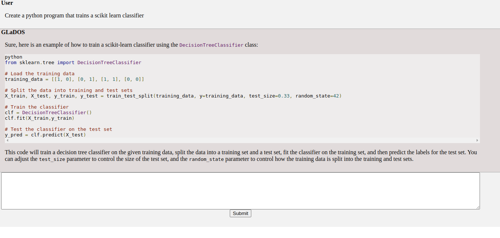
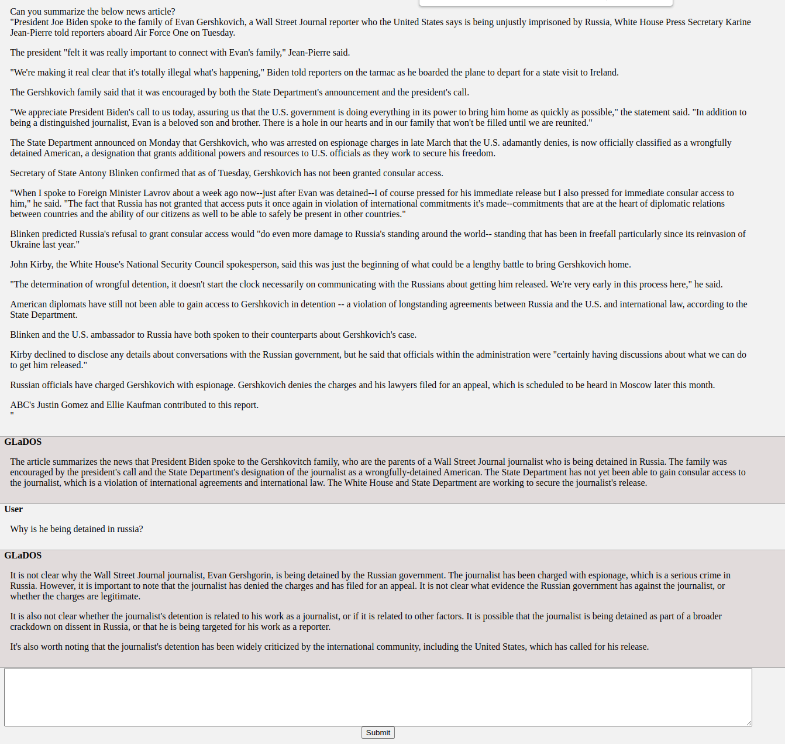
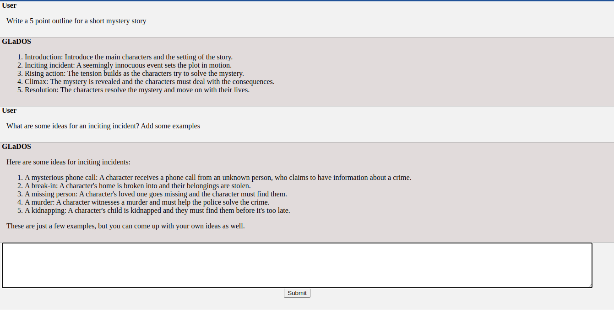

# What is GLaDOS?
GLaDOS is a family of large language models tuned to provide an open-source experience _similar_ _to_ ChatGPT. 

This repo includes the models and a basic web server to chat with them.

## Motivation
Similar models exist but often utilize LLAMA which is only available under a noncommercial license. GLaDOS avoids this by utilizing EleutherAI's/togethercomputers apache 2.0 licensed base models and CC0 data.
Additionally, GLaDOS is designed to be run fully standalone so you don't need to worry about your information being collected by a third party.

## Quickstart

GLaDOS is designed to run with docker. Instructions for installing docker https://docs.docker.com/get-docker/

First start the redis server needed to cache conversations
```
bash start_redis.sh
```
Second, build and run the GLaDOS server image/container with

```
bash build_and_run.sh
```

Then, from inside this container run 
```
python src/run_server.py
```
This will run the server with default settings of the 7b RedPajama based GLaDOS model.
To run a different model you can pass the model path. For example
```
python src/run_server.py --model models/glados_together_20b
```
will run the 20 billion GPT-NeoX based model.

Various model options are listed below

## Model Options
Each model is fine-tuned with LoRA on the GLaDOS dataset to produce conversation, github flavored markdown.\
Bigger models require more video memory to run, but also perform better.\
The default model is redpajama7b_base

NOTE : To run the starcoder model you need to pass a token to src/run_server.py in order to download the model.
Ex.
```
python src/run_server.py --model models/glados_starcoder --token <YOUR TOKEN HERE>
```

| Model Path | Base Model | Parameters | License | Strengths |
| ----- | --- | --- | --- | --- |
| models/glados_together_20b | togethercomputer/GPT-NeoXT-Chat-Base-20B | 20 Billion | Apache 2.0 | Best Overall Performance |
| models/glados_redpajama7b_base (default) | togethercomputer/RedPajama-INCITE-Base-7B-v0.1 | 6.9 Billion | Apache 2.0 | Most resource efficient with good performance. (Default) |
| models/glados_starcoder | bigcode/starcoder | 15.5 Billion | BigCode OpenRAIL-M v1 | Best code & related performance |
| models/neox_20b_full (deprecated) | togethercomputer/GPT-NeoXT-Chat-Base-20B | 20 Billion | Apache 2.0 | Old version of glados_together_20b |

One the model comes online it will be available at localhost:5950 and will print a URL you can open in your browser.

The first time the model runs it will download the base model, which is `togethercomputer/GPT-NeoXT-Chat-Base-20B`.

GLaDOS is fine-tuned on ShareGPT data. ShareGPT data is available under a CC0 (No rights reserved) license https://huggingface.co/datasets/RyokoAI/ShareGPT52K

If you want to leave the server running you can build the container inside tmux, or modify the docker file to run the server directly.

## License
Apache 2.0 License, see LICENSE.md

Note the starcoder basemodel uses an OpenRAIL license, and usage of the starcoder based model may be subject to that.
See https://huggingface.co/bigcode/starcoder for more details. The jist of it is that usage for certain 'unethical' use cases is not allowed.

## Examples (Old)
Basic Code Generation (Emphasis on basic)


Summarization and follow up questions


Brainstorming


## Resource Requirements
The default model is based on RedPajama 7b, and can run on 24GB Nvidia graphics Cards. Short sequences may also be possible on 16GB graphics cards, but this is untested/I wouldn't recommend it.

Other models currently require more video memory- with testing/my hosting being done on 48GB A6000 GPUs.

It is possible to use GPTQ to reduce the memory about 4x, but there is no timeline for completion of this.

## Misc QnA

Q : Is the model as good as ChatGPT?

A : No, GLaDOS is only trained with SFT (no RLHF) on a relatively small (~50k) examples and uses a base model that is trained with less data, and fewer parameters, than OpenAI's GPT4 or even the larger/later iteration of GPT3 models. OpenAI has far more data and resources that make it possible to create bots like ChatGPT.

Q : If your model is trained on ChatGPT responses why doesn't it think it is ChatGPT?

A : Data has been transformed and filtered to remove OpenAI/ChatGPT related prompts. I leave items that only talk about it being a language model, so it has some sense of what it is, but it will often hallucinate information about who created it.

Q : How does the model handle formatting?

A : GLaDOS uses a slight variation on github flavored markdown to create lists tables and code blocks. Extra tags are added by the webserver to prettify the code blocks and tweak other small things.


=======
# Acknowledgements:

Big thanks to EleutherAI for GPT-NeoX, togethercomputer for GPT-Neoxt-chat-base and ShareGPT/RyokoAI for ShareGPT data!
